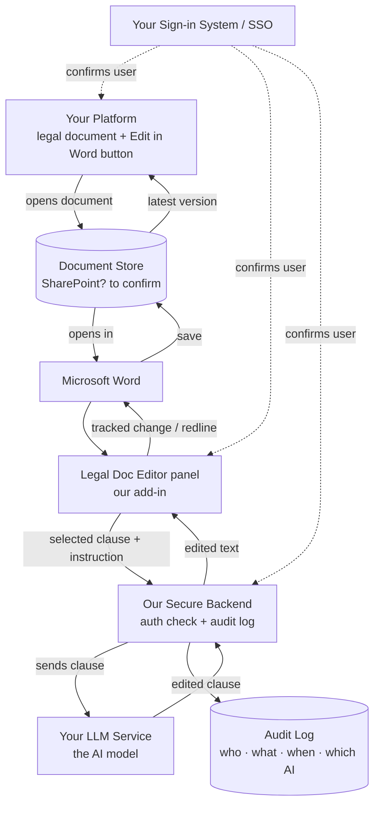

# AI-Assisted Legal Document Editing in Microsoft Word
## Solution Overview & Flow

Prepared for review. This document explains, in plain language, how we propose to add AI-powered
editing to your legal documents directly inside Microsoft Word, and what we would need from your
side to build it.

---

## 1. What we are building

Your platform already lets a user open a legal document (a `.docx` file) in Microsoft Word with a
single click. We are adding an AI assistant that lives inside Word as a side panel.

The user highlights a clause, types a plain-English instruction — "make this mutual", "tighten
this", "soften the liability language" — and the AI rewrites it. The change appears as a **tracked
change (a redline)**, exactly like a colleague's edit, so the lawyer reviews it and clicks **Accept**
or **Reject**. When the document is saved, the updates flow back into your platform automatically.

---

## 2. The user's journey

```
 ①  User opens a legal document in YOUR platform
        |   clicks the existing "Edit in Word" button
        v
 ②  The document opens in Microsoft Word
        |   the user is signed in automatically (single sign-on)
        v
 ③  The "Legal Doc Editor" panel appears inside Word
        |   user highlights a clause and types an instruction
        v
 ④  The AI rewrites the clause -> it appears as a tracked change (redline)
        |   user reviews and clicks Accept or Reject
        v
 ⑤  Word saves the document back to its source
        v
 ⑥  YOUR platform shows the updated document automatically
```

Steps ① ② ⑤ ⑥ already exist in your workflow today. We are adding the panel and the AI editing in
steps ③ ④; everything around it stays the same.

---

## 3. How the pieces fit together

A top-to-bottom view of who does what. Each arrow is one hop.

```
  ┌─ YOUR PLATFORM
  │    • displays legal documents
  │    • "Edit in Word" button (already built)
  │    • re-reads the document after each save
  └──▶ opens the document        ◀── latest saved version comes back here
         │
         ▼
  ┌─ DOCUMENT STORE  (assumed Microsoft 365 / SharePoint — to confirm)
  │    stores the .docx file
  │       • open  +  save
  │    Microsoft Word  (desktop or web)
  │       └─ "Legal Doc Editor" panel  (our add-in)
  └──▶ "edit this clause: …"
         │
         ▼
  ┌─ OUR SECURE BACKEND
  │    • confirms who the user is (via your sign-in)
  │    • sends the selected text + instruction to the AI
  │    • records every edit in an audit log
  └──┬───────────────────────────┬
     │                           │
     ▼                           ▼
  YOUR LLM SERVICE            AUDIT LOG
  (the AI model)             who · what · when · which AI · accepted?


  YOUR SIGN-IN SYSTEM (SSO)
     — confirms the user across the platform, Microsoft Word, and our backend
```

### The same picture, as a diagram (renders on GitHub and most viewers)



### What each piece does

| Piece | Role | Who provides it |
|---|---|---|
| Your platform | Shows the document, opens it in Word, displays the updated version after saving | You (exists today) |
| Document store | Stores the `.docx` and handles open + save + version history | You (assumed SharePoint — to confirm) |
| Microsoft Word | Where the editing happens | Microsoft (user's app) |
| Legal Doc Editor panel | The side panel the user works in — select, instruct, review redline | We build this |
| Our secure backend | Confirms identity, passes text to the AI, keeps the audit log. AI credentials live here, never in the user's browser | We build this |
| Your LLM service | The AI model that rewrites the text | You |
| Audit log | A permanent record of every AI edit, for compliance | We build this |
| Your sign-in system (SSO) | Confirms the user across all parts | You |

---

## 4. How the editing works for the user

- The user selects a clause and types an instruction in plain English.
- The AI rewrites the selected text and returns it as a tracked change (redline), the same way a
  colleague's edit would appear.
- Nothing changes silently. The lawyer reviews each suggestion and clicks Accept or Reject using
  Word's normal review tools.
- Defined terms and clause numbering are preserved as the user expects.
- Every edit is recorded in the audit log.

---

## 5. Open questions — understanding your system

The design above assumes how your platform works today. These answers decide what we build and where
the real effort is.

### A. Your current document workflow
- Do you already have an **in-app editor** (editing inside your platform, not Word)? If so, AI editing
  may need to work there too, and we must keep the two in sync and prevent overwrites.
- **Where are documents stored** — SharePoint / OneDrive, or another system (your database, blob
  storage, a DMS)?
- **How does today's "Edit in Word" button work** — SharePoint, a desktop link, or Word on the web?
- **After a save, how does your app pick up the new version** — auto-refresh, polling, webhook, or manual?

### B. The AI experience inside Word
- **Direct edit, or review-then-edit?** Apply the change immediately as a redline, or show it in the
  panel for approval first?
- **History in the panel** — show past instructions / edits for this document or user?
- **File upload in the panel** — let users upload a reference template or standard terms for the AI to
  redline against?

### C. User-specific data & context
- Based on the signed-in user, do you **pull any data** the AI should use — templates, clause
  libraries, playbooks, matter/client context? Where does it live and who controls access?
- Should available templates or AI behavior **differ by user role, team, or client**?

### D. Identity & access
- Which **SSO / identity provider**?
- Does the signed-in identity **control what documents or templates a user can see**?
- **One organization, or multiple firms/clients** with strict data separation?

### E. Saving & conflicts
- Can the platform **lock a document while it is open in Word**, to prevent the app (or an in-app
  editor) and Word from overwriting each other?

### F. Hosting
- Should **our backend run in your environment**, or be hosted by us?

---

## 6. Assumptions

These are the assumptions behind the design above. The Open Questions are how we confirm them; if any
are wrong, the design changes.

1. Documents are Word `.docx` files.
2. Your platform already opens a document in Word and shows the updated version after it is saved.
3. There is a single, agreed source of truth for the document while it is open in Word.
4. You already operate an LLM service we can call.
5. You have an identity / single-sign-on system we can integrate with.
6. Users have Microsoft 365 with Microsoft Word.
7. Editing starts clause-by-clause on a selection.

---

## 7. Prerequisites — what we would need from you

- **AI service** — API access to your LLM service: endpoint, credentials, model, and usage limits.
- **Identity & sign-in** — integration details for your SSO, and permission for the add-in to act on
  the user's behalf when reading and writing the document.
- **Document access** — confirmation of where documents live, and the access needed to read them and
  their version history.
- **Deployment** — a Microsoft 365 administrator to deploy the add-in privately to your users.
- **Hosting** — a place to host our backend, or approval to host it, reachable over secure HTTPS.
- **Data-handling sign-off** — agreement on what document content may be sent to the AI.
- **For testing** — sample documents and a test user account so we can validate the full round-trip.

---

## 8. Data & security

- AI credentials live on our backend, never in the user's browser or the Word panel.
- The only content that leaves your environment is the specific text the user chooses to edit, sent
  to your AI service.
- Every edit is recorded in an append-only audit log: who made it, the instruction, which AI model
  and version, the before and after text, the time, and whether it was accepted — a compliance trail
  that Word's own version history cannot provide.
- All connections are encrypted in transit.
